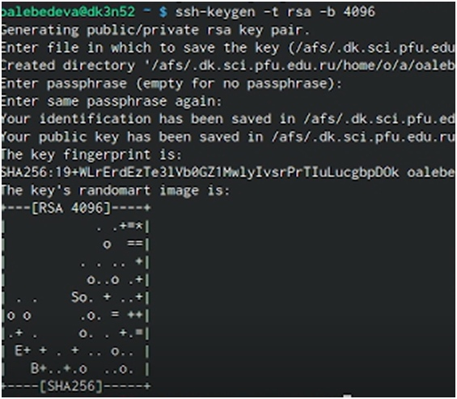
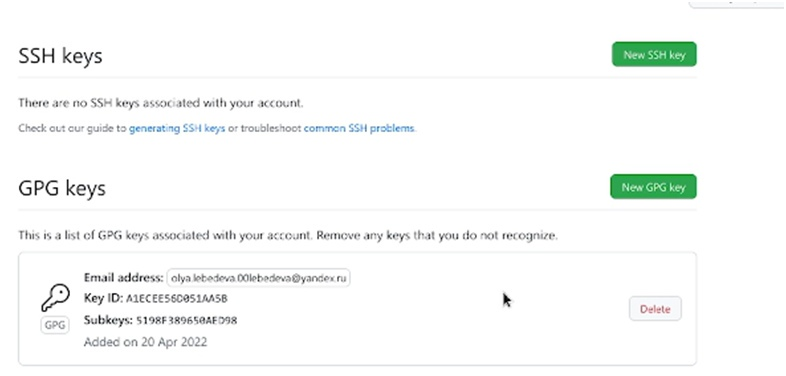
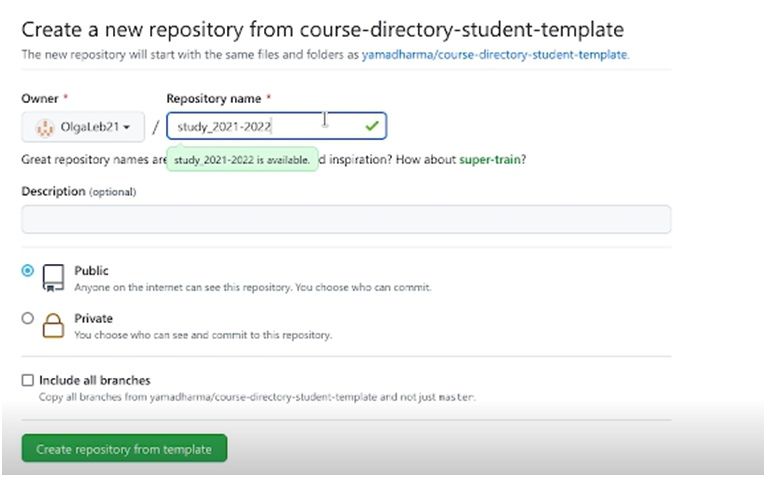
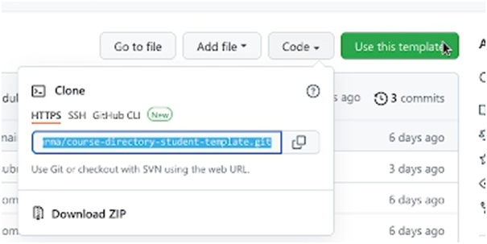
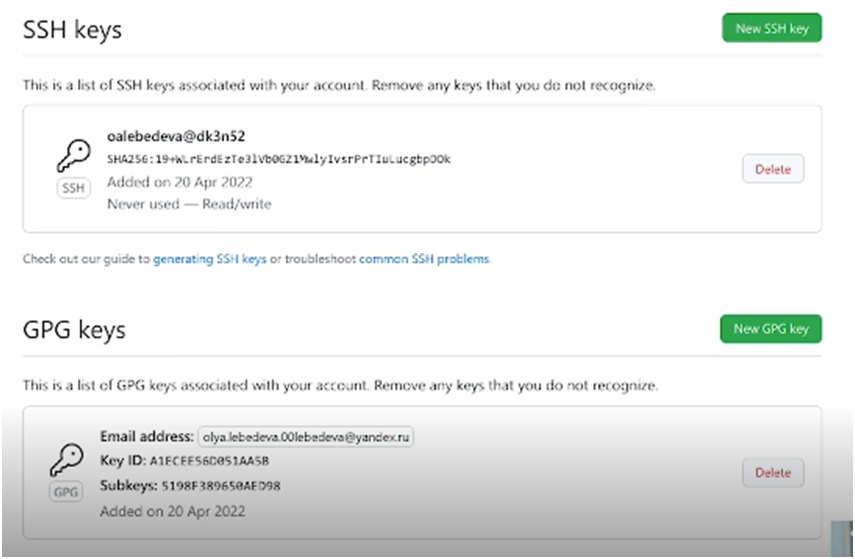
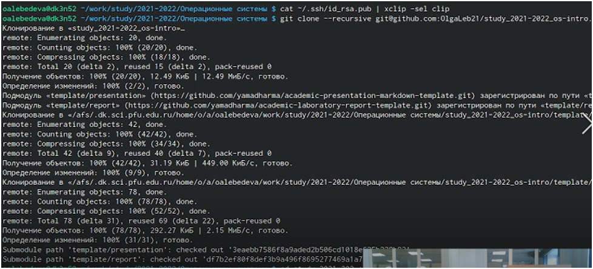
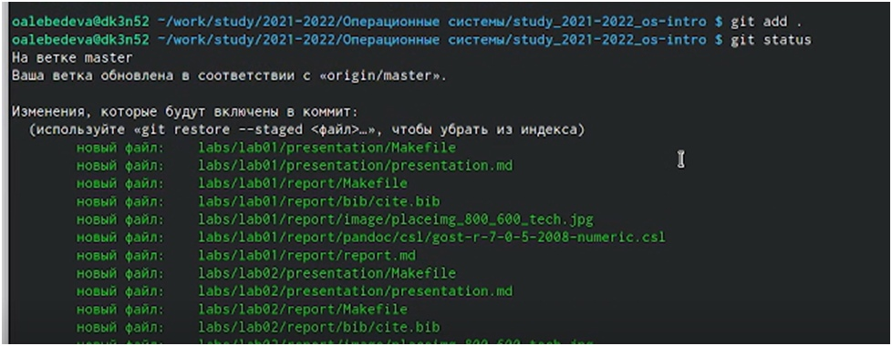

---
## Front matter
title: "Лабораторная работа 2"
subtitle: "Управление версиями"
author: "Лебедева Ольга Андреевна"

## Generic otions
lang: ru-RU
toc-title: "Содержание"

## Pdf output format
toc: true # Table of contents
toc-depth: 2
fontsize: 12pt
linestretch: 1.5
papersize: a4
documentclass: scrreprt
## I18n polyglossia
polyglossia-lang:
name: russian
options:
- spelling=modern
- babelshorthands=true
polyglossia-otherlangs:
name: english
## I18n babel
babel-lang: russian
babel-otherlangs: english
## Fonts
mainfont: PT Serif
romanfont: PT Serif
sansfont: PT Sans
monofont: PT Mono
mainfontoptions: Ligatures=TeX
romanfontoptions: Ligatures=TeX
sansfontoptions: Ligatures=TeX,Scale=MatchLowercase
monofontoptions: Scale=MatchLowercase,Scale=0.9
## Biblatex
biblatex: true
biblio-style: "gost-numeric"
biblatexoptions:
- parentracker=true
- backend=biber
- hyperref=auto
- language=auto
- autolang=other*
- citestyle=gost-numeric
## Pandoc-crossref LaTeX customization
figureTitle: "Рис."
tableTitle: "Таблица"
listingTitle: "Листинг"
lofTitle: "Список иллюстраций"
lotTitle: "Список таблиц"
lolTitle: "Листинги"
## Misc options
indent: true
header-includes:
- \usepackage{indentfirst}
- \usepackage{float} # keep figures where there are in the text
- \floatplacement{figure}{H} # keep figures where there are in the text
---

## Цель работы
– Изучить идеологию и применение средств контроля версий. 

– Освоить умения по работе с git.

## Указания к лабораторной работе 
Система контроля версий Git представляет собой набор программ командной строки. Доступ к ним можно получить из терминала посредством ввода команды git с различными опциями.

## Последовательность выполнения работы 
Настройка github 

1. Создайте учётную запись на https://github.com. 
2. Заполните основные данные на https://github.com. (рис. [-@fig:001])

{ #fig:001 width=70% }

## Базовая настройка git 
– Зададим имя и email владельца репозитория: (рис. [-@fig:002])

git config --global user.name "Name Surname" 

git config --global user.email "work@mail"

{ #fig:002 width=70% }

Настроим верификацию и подписание коммитов git. 

– Зададим имя начальной ветки (будем называть её master):(рис. [-@fig:003])

{ #fig:003 width=70% }

## Создание ключей ssh

Генерируем ключ (рис. [-@fig:004])

gpg --full-generate-key

{ #fig:004 width=70% }

Из предложенных опций выбираем:(рис. [-@fig:005])
 – тип RSA and RSA; 

– размер 4096; 

– выберите срок действия; значение по умолчанию— 0 (срок действия не истекает никогда). 

– GPG запросит личную информацию, которая сохранится в ключе: 
– Имя (не менее 5 символов). 

– Адрес электронной почты. 

– При вводе email убедитесь, что он соответствует адресу, используемому на GitHub.

 – Комментарий. Можно ввести что угодно или нажать клавишу ввода, чтобы оставить это поле пустым.

{ #fig:005 width=70% }

## Добавление PGP ключа в GitHub 

– Выводим список ключей и копируем отпечаток приватного ключа:(рис. [-@fig:006]) 

gpg --list-secret-keys --keyid-format LONG

{ #fig:006 width=70% }

Перейдём в настройки GitHub (https://github.com/settings/keys), нажмём на кнопку New GPG key и вставим полученный ключ в поле ввода.(рис. [-@fig:007])

{ #fig:007 width=70% }

## Создание репозитория
Шаблон для рабочего пространства – Репозиторий: https://github.com/yamadharma/course-directory-student-template.(рис. [-@fig:008])

{ #fig:008 width=70% }

Создание репозитория примет следующий вид: 

mkdir -p ~/work/study/2021-2022/"Операционные системы" 

cd ~/work/study/2021-2022/"Операционные системы" 

gh repo create study_2021-2022_os-intro 
↪ --template=yamadharma/course-directory-student-template –public

git clone --recursive 
↪ git@github.com:/study_2021-2022_os-intro.git os-intro

Команда gh оказалась недоступной для использования, поэтому мы пошли другим путём:(рис. [-@fig:009])

Клонируем репозиторий, представленный в виде шаблона.(рис. [-@fig:011])

{ #fig:009 width=70% }

Далее, аналогично ключам GPG впишем ключи SSH:(рис. [-@fig:010])

{ #fig:010 width=70% }

{ #fig:011 width=70% }

## Настройка каталога курса
Перейдем в каталог курса и удалим лишние файлы:(рис. [-@fig:012])

{ #fig:012 width=70% }

Отправим файлы на сервер:(рис. [-@fig:013])

git add . 

git commit -am 'feat(main): make course structure' 

git push 

{ #fig:013 width=70% }

## Настройка автоматических подписей коммитов git
 – Используя введёный email, укажем Git применять его при подписи коммитов:(рис. [-@fig:014])  (рис. [-@fig:015])

 git config --global user.signingkey 

git config --global commit.gpgsign true 

git config --global gpg.program $(which gpg2)

{ #fig:014 width=70% }

{ #fig:015 width=70% }

## Вывод

– Изучили идеологию и применение средств контроля версий. 

– Освоили умения по работе с git.

## Контрольные вопросы 

1. Что такое системы контроля версий (VCS) и для решения каких задач они предназначаются? 

Система контроля версий — это система, записывающая изменения в файл или набор файлов в течение времени и позволяющая вернуться позже к определённой версии. Для контроля версий файлов в этой книге в качестве примера будет использоваться исходный код программного обеспечения, хотя на самом деле вы можете использовать контроль версий практически для любых типов файлов.

2. Объясните следующие понятия VCS и их отношения: хранилище, commit, история, рабочая копия. 

Репозиторий - хранилище версий - в нем хранятся все документы вместе с историей их изменения и другой служебной информацией
Commit («[трудовой] вклад», не переводится) — процесс создания новой версии
Рабочая копия (working copy) — текущее состояние файлов проекта, основанное на версии, загруженной из хранилища (обычно на последней).
Версия (revision), или ревизия, — состояние всех файлов на определенный момент времени, сохраненное в репозитарии, с дополнительной информацией

3. Что представляют собой и чем отличаются централизованные и децентрализованные VCS? Приведите примеры VCS каждого вида. 

Централизованные системы — это системы, которые используют архитектуру клиент / сервер, где один или несколько клиентских узлов напрямую подключены к центральному серверу. (Пример — Wikipedia.)
В децентрализованных системах каждый узел принимает свое собственное решение. Конечное поведение системы является совокупностью решений отдельных узлов. (Пример — Bitcoin)

4. Опишите действия с VCS при единоличной работе с хранилищем.(рис. [-@fig:016]) 

{ #fig:016 width=70% }

5. Опишите порядок работы с общим хранилищем VCS. (рис. [-@fig:017])

{ #fig:017 width=70% }

6. Каковы основные задачи, решаемые инструментальным средством git? 

У Git есть две основные задачи: хранить информацию обо всех изменениях в коде, начиная с самой первой строчки, и обеспечить удобства командной работы над кодом.

7. Назовите и дайте краткую характеристику командам git. 

– создание основного дерева репозитория: git init

– получение обновлений (изменений) текущего дерева из центрального репозитория: git pull 

– отправка всех произведённых изменений локального дерева в центральный репозиторий: git push 

– просмотр списка изменённых файлов в текущей директории: git status 

– просмотр текущих изменения: git diff 

– сохранение текущих изменений: 
– добавить все изменённые и/или созданные файлы и/или каталоги: git add . 

– добавить конкретные изменённые и/или созданные файлы и/или каталоги: git add имена_файлов 

– удалить файл и/или каталог из индекса репозитория (при этом файл и/или каталог остаётся в локальной директории): git rm имена_файлов 

8. Приведите примеры использования при работе с локальным и удалённым репозиториями. 

Локальный репозиторий — она же директория “.git”. В ней хранятся коммиты и другие объекты.
Удаленный репозиторий – тот самый репозиторий который считается общим, в который вы можете передать свои коммиты из локального репозитория, что бы остальные программисты могли их увидеть. Удаленных репозиториев может быть несколько, но обычно он бывает один.

9. Что такое и зачем могут быть нужны ветви (branches)? 

‘Git branch’ – это команда для управления ветками в репозитории Git.
Ветка – это просто «скользящий» указатель на один из коммитов. Когда мы создаём новые коммиты, указатель ветки автоматически сдвигается вперёд, к вновь созданному коммиту.
Ветки используются для разработки одной части функционала изолированно от других. Каждая ветка представляет собой отдельную копию кода проекта. Ветки позволяют одновременно работать над разными версиями проекта.
Ветвление («ветка», branch) — один из параллельных участков истории в одном хранилище, исходящих из одной версии (точки ветвления). Ветки нужны для того, чтобы программисты могли вести совместную работу над проектом и не мешать друг другу при этом.

10. Как и зачем можно игнорировать некоторые файлы при commit?

Игнорируемые файлы обычно представляют собой файлы, специфичные для платформы, или автоматически созданные из сборочных систем. Временно игнорировать изменения в файле можно командой: git update-index —assume-unchanged <file>

