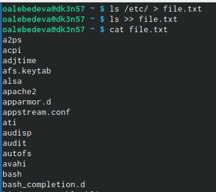
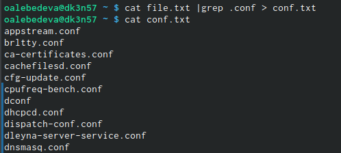
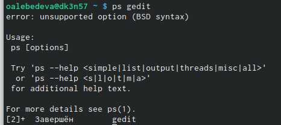
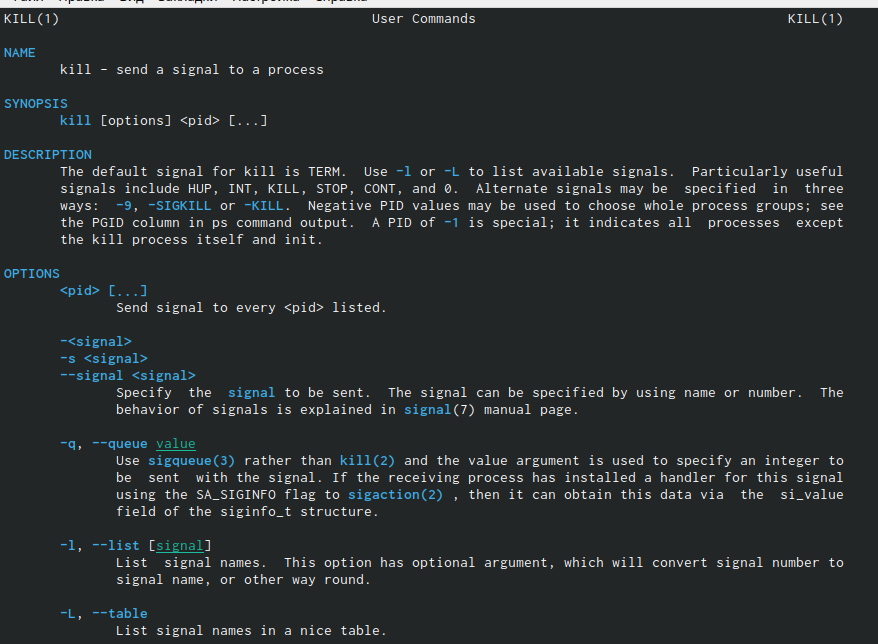
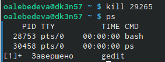
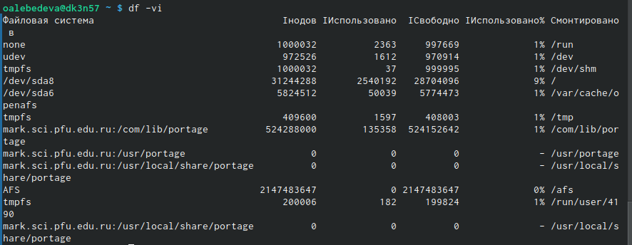
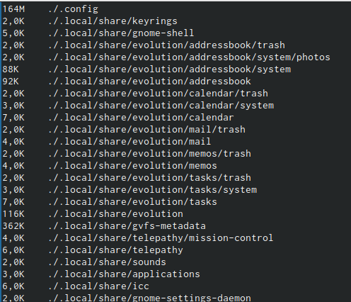
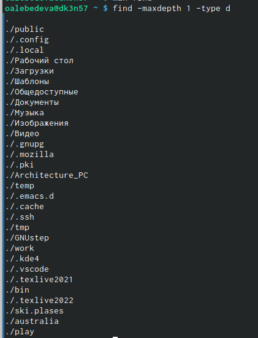

---
## Front matter
title: "Лебораторная работа №6"
subtitle: "Поиск файлов. Перенаправление
ввода-вывода. Просмотр запущенных процессов"
author: "Лебедева Ольга Андреевна"

## Generic otions
lang: ru-RU
toc-title: "Содержание"

## Bibliography
bibliography: bib/cite.bib
csl: pandoc/csl/gost-r-7-0-5-2008-numeric.csl

## Pdf output format
toc: true # Table of contents
toc-depth: 2
lof: true # List of figures
lot: true # List of tables
fontsize: 12pt
linestretch: 1.5
papersize: a4
documentclass: scrreprt
## I18n polyglossia
polyglossia-lang:
  name: russian
  options:
	- spelling=modern
	- babelshorthands=true
polyglossia-otherlangs:
  name: english
## I18n babel
babel-lang: russian
babel-otherlangs: english
## Fonts
mainfont: PT Serif
romanfont: PT Serif
sansfont: PT Sans
monofont: PT Mono
mainfontoptions: Ligatures=TeX
romanfontoptions: Ligatures=TeX
sansfontoptions: Ligatures=TeX,Scale=MatchLowercase
monofontoptions: Scale=MatchLowercase,Scale=0.9
## Biblatex
biblatex: true
biblio-style: "gost-numeric"
biblatexoptions:
  - parentracker=true
  - backend=biber
  - hyperref=auto
  - language=auto
  - autolang=other*
  - citestyle=gost-numeric
## Pandoc-crossref LaTeX customization
figureTitle: "Рис."
tableTitle: "Таблица"
listingTitle: "Листинг"
lofTitle: "Список иллюстраций"
lotTitle: "Список таблиц"
lolTitle: "Листинги"
## Misc options
indent: true
header-includes:
  - \usepackage{indentfirst}
  - \usepackage{float} # keep figures where there are in the text
  - \floatplacement{figure}{H} # keep figures where there are in the text
---

# Цель работы

Ознакомление с инструментами поиска файлов и фильтрации текстовых данных. Приобретение практических навыков: по управлению процессами (и заданиями), по проверке использования диска и обслуживанию файловых систем.

# Теоретическое введение

В системе по умолчанию открыто три специальных потока:

– stdin — стандартный поток ввода (по умолчанию: клавиатура), файловый дескриптор
0;

– stdout — стандартный поток вывода (по умолчанию: консоль), файловый дескриптор
1;

– stderr — стандартный поток вывод сообщений об ошибках (по умолчанию: консоль),
файловый дескриптор 2.

Конвейер (pipe) служит для объединения простых команд или утилит в цепочки, в которых результат работы предыдущей команды передаётся последующей.

Команда find используется для поиска и отображения на экран имён файлов, соответствующих заданной строке символов.

Найти в текстовом файле указанную строку символов позволяет команда grep.

Команда df показывает размер каждого смонтированного раздела диска.

Любую выполняющуюся в консоли команду или внешнюю программу можно запустить
в фоновом режиме. Для этого следует в конце имени команды указать знак амперсанда
&.

Команда ps используется для получения информации о процессах

# Ход работы

Осуществили вход в систему, используя соответствующее имя пользователя.

Записали в файл file.txt названия файлов, содержащихся в каталоге /etc. Дописали в этот же файл названия файлов, содержащихся в вашем домашнем каталоге. (рис. [-@fig:001])

{ #fig:001 width=70% }

Вывели имена всех файлов из file.txt, имеющих расширение .conf, после чего записали их в новый текстовой файл conf.txt. (рис. [-@fig:002])

{ #fig:002 width=70% }

Определили, какие файлы в нашем домашнем каталоге имеют имена, начинавшиеся
с символа c. Предложили несколько вариантов, как это сделать. (рис. [-@fig:005]) (рис. [-@fig:004])

{ #fig:005 width=70% }

{ #fig:004 width=70% }

Вывели на экран (по странично) имена файлов из каталога /etc, начинающиеся с символа h. (рис. [-@fig:006])

{ #fig:006 width=70% }

Запустили в фоновом режиме процесс, который будет записывать в файл ~/logfile файлы, имена которых начинаются с log. (рис. [-@fig:007]) (рис. [-@fig:008])

{ #fig:008 width=70% }

{ #fig:007 width=70% }

Удалили файл ~/logfile. (рис. [-@fig:009])

{ #fig:009 width=70% }

Запустили из консоли в фоновом режиме редактор gedit. (рис. [-@fig:010])

{ #fig:010 width=70% }

Определили идентификатор процесса gedit, используя команду ps, конвейер и фильтр grep. (рис. [-@fig:011]) (рис. [-@fig:012]) (рис. [-@fig:013]) (рис. [-@fig:014])

{ #fig:011 width=70% }

{ #fig:012 width=70% }

{ #fig:013 width=70% }

{ #fig:014 width=70% }

Прочитали справку (man) команды kill, после чего использовали её для завершения
процесса gedit. (рис. [-@fig:015]) (рис. [-@fig:016]) (рис. [-@fig:017])

{ #fig:016 width=70% }

{ #fig:015 width=70% }

{ #fig:017 width=70% }

Выполнили команды df и du, предварительно получив более подробную информацию
об этих командах, с помощью команды man. (рис. [-@fig:018]) (рис. [-@fig:019]) (рис. [-@fig:020])

{ #fig:018 width=70% }

{ #fig:019 width=70% }

{ #fig:021 width=70% }

{ #fig:020 width=70% }

Воспользовавшись справкой команды find, вывели имена всех директорий, имеющихся в нашем домашнем каталоге. (рис. [-@fig:021]) (рис. [-@fig:022])

{ #fig:022 width=70% }

{ #fig:023 width=70% }

# Вывод

Позакомились с инструментами поиска файлов и фильтрации текстовых данных. Приобретли практические навыки: по управлению процессами (и заданиями), по проверке использования диска и обслуживанию файловых систем.

1. Какие потоки ввода вывода вы знаете?

– stdin — стандартный поток ввода (по умолчанию: клавиатура), файловый дескриптор
0;

– stdout — стандартный поток вывода (по умолчанию: консоль), файловый дескриптор
1;

– stderr — стандартный поток вывод сообщений об ошибках (по умолчанию: консоль),
файловый дескриптор 2

2. Объясните разницу между операцией > и >>.

Символ < используется для переназначения стандартного ввода команды. Символ >> используется для присоединения данных в конец файла стандартного вывода команды(файл открывается в режиме добавления)

3. Что такое конвейер?

Конвейер (pipe) служит для объединения простых команд или утилит в цепочки, в которых результат работы предыдущей команды передаётся последующей.

4. Что такое процесс? Чем это понятие отличается от программы?

Процесс - это программа, которая выполняется в отдельном виртуальном адресном пространстве. Когда пользователь регистрируется в системе, автоматически создается процесс, в котором выполняется оболочка (shell), например, /bin/bash. Компьютерная программа сама по себе — это только пассивная совокупность инструкций, в то время как процесс — это непосредственное выполнение этих инструкций.

5. Что такое PID и GID?

Process ID(PID) - идентификатор порожденного процесса. Group ID (GID-идентификация группы пользователей.

6. Что такое задачи и какая команда позволяет ими управлять?

Запущенные фоном программы называются задачами (jobs). Ими можно управлять с помощью команды jobs, которая выводит список запущенных в данный момент задач. Для завершения задачи необходимо выполнить команду : kill %номер задачи

7. Найдите информацию об утилитах top и htop. Каковы их функции?

top показывает объем занятой памяти вместе с кэш. htop выдает объём реально занятой памяти без кэша.

8. Назовите и дайте характеристику команде поиска файлов. Приведите примеры использования этой команды.

find : Для поиска файлов из командной строки вы можете использовать команду “find”.

9. Можно ли по контексту (содержанию) найти файл? Если да, то как?

Для поиска файла по содержимому проще всего воспользоваться командой grep (вместо find).

10. Как определить объем свободной памяти на жёстком диске?

Самый простой способ найти свободное место на диске в Linux - это используйте команду df

11. Как определить объем вашего домашнего каталога?

Команда du показывает число килобайт, используемое каждым файлом или каталогом.

12. Как удалить зависший процесс?

Находим PID зависшего процесса Каждый процесс в Linux имеет свой идентификатор, называемый PID. 
«Убиваем» процесс командой kill.
